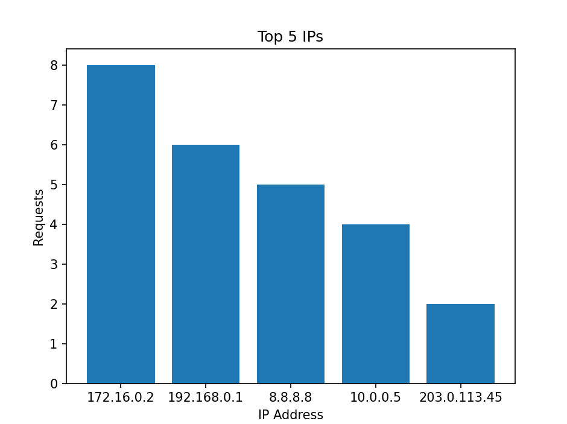
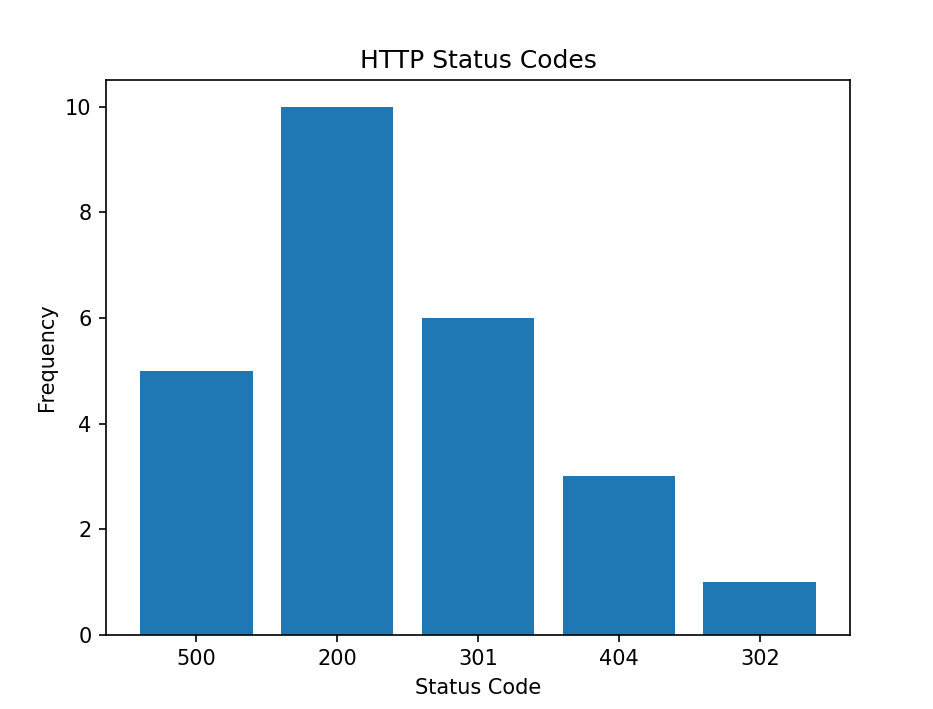

# 📊 Log File Analyzer

A Python project that analyzes and visualizes **web server log files** (Apache/Nginx style).  
The script uses **regular expressions** to extract useful information and **Matplotlib** to generate charts.  

---

## 📂 Project Structure

```
LOG FILE ANALYZER
│
├── info.txt             # Sample log file with requests
├── analyzer.py          # Main script (regex + matplotlib)
└── README.md            # Project documentation
```

---

## 💻 How it works

1. The script reads each line from the log file.  
2. Using **Regex**, it extracts:  
   - the **IP address**  
   - the **date** of the request  
   - the **HTTP method** (GET/POST)  
   - the **URL** requested  
   - the **status code** (200, 301, 404, 500 …)  
3. It counts the most common values using **`collections.Counter`**.  
4. It generates charts with **Matplotlib** for:  
   - **Top 5 IP addresses**  
   - **HTTP status codes**  

---

## ⚙️ Technologies used

- **Python 3.x**  
- `re` – for regex pattern matching  
- `collections.Counter` – for counting occurrences  
- `matplotlib` – for plotting graphs  

---

## 🚀 Run the project

1. Clone the repository:
   ```bash
   git clone https://github.com/USERNAME/log-file-analyzer.git
   cd log-file-analyzer
   ```

2. Install dependencies (if not already installed):
   ```bash
   pip install matplotlib
   ```

3. Run the script:
   ```bash
   python analyzer.py
   ```

---

## 📊 Example output

- **Top 5 IP addresses** – bar chart  
- **HTTP Status Codes** – bar chart  

Example log entry from `info.txt`:  
```
8.8.8.8 - - [10/Oct/2025:04:59:06 +0300] "GET /register HTTP/1.1" 500 2048
172.16.0.2 - - [07/Oct/2025:10:47:09 +0300] "GET /contact HTTP/1.1" 200 8192
```

Running the script will generate visualizations like:  

1.For Top 5 IP:


---
